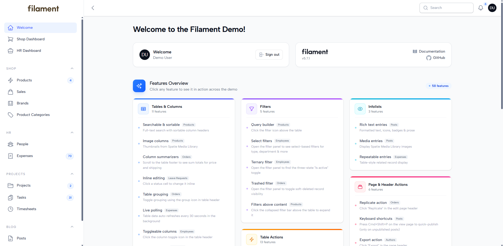
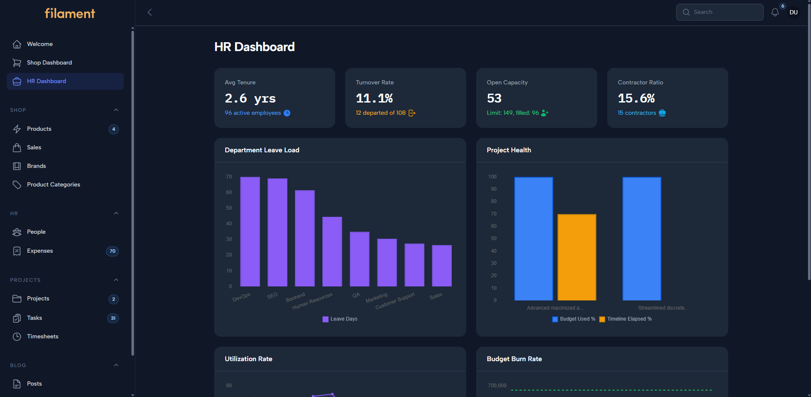
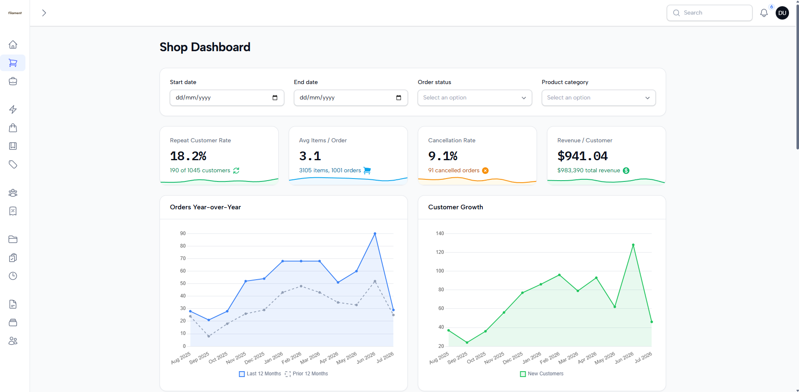
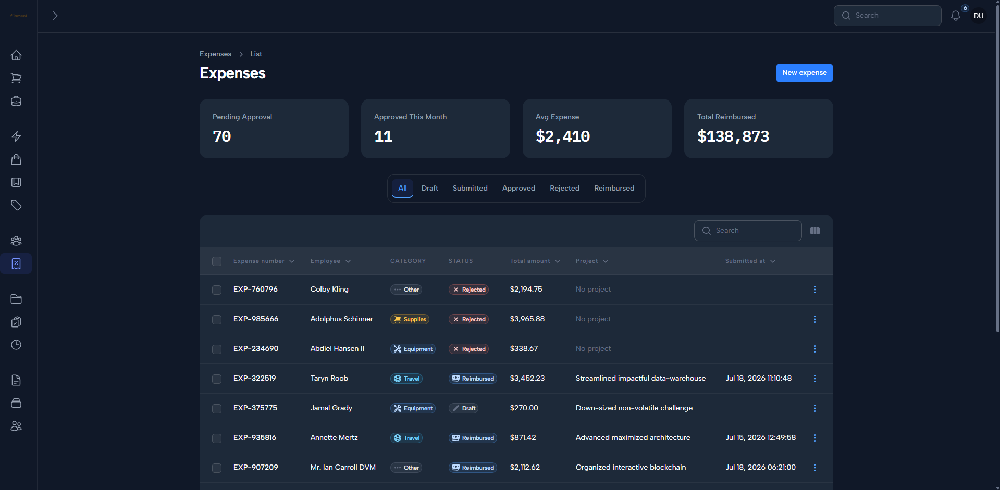
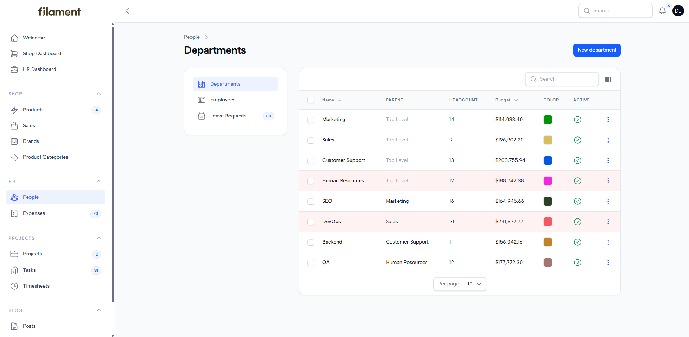
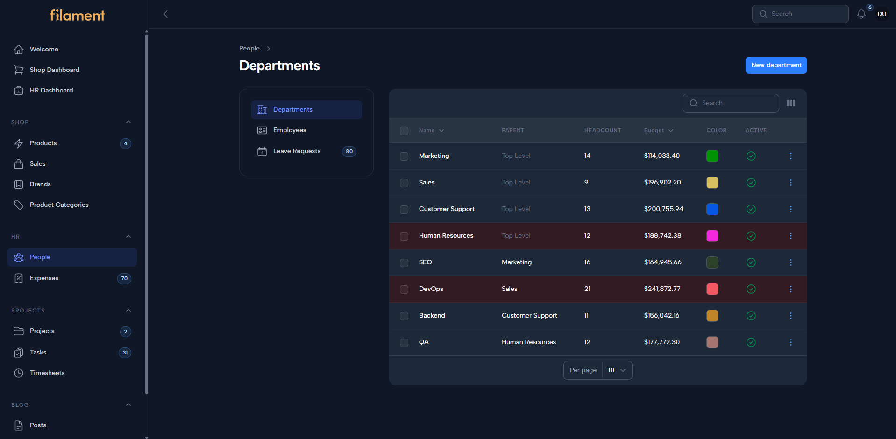

# Arasy Theme

<p align="center">
    <a href="https://packagist.org/packages/rafyakbar/arasy-theme">
        
    </a>
    <a href="https://filamentphp.com">
        
    </a>
    <a href="https://packagist.org/packages/rafyakbar/arasy-theme">
        
    </a>
    <a href="LICENSE.md">
        
    </a>
</p>

A modern FilamentPHP v5 theme plugin inspired by the TailAdmin design language — vibrant indigo accents, Outfit typography, consistent border radius, sleek custom scrollbar, and full dark mode support.

**Table of Contents**

- [Features](#features)
- [Compatibility](#compatibility)
- [Requirements](#requirements)
- [Installation](#installation)
  - [Automatic Setup](#automatic-setup)
  - [Manual Setup](#manual-setup)
- [Usage & Configuration](#usage--configuration)
  - [Quick Start](#quick-start)
  - [Sidebar Brand Name](#sidebar-brand-name)
  - [Collapsed Sidebar Logo](#collapsed-sidebar-logo)
  - [Custom Logo & Branding](#custom-logo--branding)
- [What's Included](#whats-included)
  - [File Structure](#file-structure)
  - [CSS Architecture](#css-architecture)
- [Changelog](#changelog)
- [License](#license)

---

## Features

- **Brand Color Palette** — Carefully crafted primary (indigo), success (green), warning (amber), danger (red), info (blue), and gray scales
- **Outfit Font** — Clean, modern sans-serif typeface loaded via Google Font Provider
- **IBM Plex Mono** — Monospace font for code, stats, and tabular data
- **Design Tokens** — CSS custom properties for border radius, shadows, colors, and transitions
- **Full Dark Mode** — Every surface, border, text, and shadow has a dark variant including the sidebar
- **Consistent Border Radius** — 16px cards, 8px inputs, 24px modals, pill badges
- **Sleek Custom Scrollbar** — Thin (4px), rounded pill-style thumb, sidebar nav gets an even thinner (3px) variant; colors adapt to light/dark mode
- **Sidebar Brand Name** — Optional brand name display beside the logo, responsive to collapse state
- **Collapsed Sidebar Logo** — Logo stays visible and centered when sidebar is collapsed (opt-in via `withCollapsedLogo()`)
- **Cluster Sub-Navigation** — Styled cluster navigation matching the sidebar appearance
- **Auth Pages** — Dark-themed login, register, and password reset pages with brand block
- **Plain CSS** — No build step required for the theme; loaded as a Filament asset
- **One-Command Setup** — `php artisan arasy:install` detects your panel and publishes assets

## Compatibility

| Package Version | Filament Version | PHP Version |
|----------------|-----------------|-------------|
| ^1.0           | v5.x            | ^8.2        |

## Requirements

- PHP 8.2+
- Laravel 10+
- Filament v5.0+

---

## Screenshots

<p align="center">
    
    
</p>
<p align="center">
    
    
</p>
<p align="center">
    
    
</p>

---

## Installation

```bash
composer require rafyakbar/arasy-theme
```

### Automatic Setup

```bash
php artisan arasy:install
```

This will detect your Filament panel, publish the theme CSS, and print next steps.

### Manual Setup

1. Register the plugin in your `PanelProvider`:

```php
use ArasyTheme\ArasyThemePlugin;

public function panel(Panel $panel): Panel
{
    return $panel
        ->plugin(ArasyThemePlugin::make());
}
```

2. Build your frontend assets:

```bash
npm run build
```

## Usage & Configuration

The plugin works with zero configuration. All options are opt-in.

### Quick Start

```php
use ArasyTheme\ArasyThemePlugin;

ArasyThemePlugin::make()
    ->withSidebarBrandName()    // Show brand name beside logo
    ->withCollapsedLogo();      // Show logo when sidebar is collapsed
```

### Sidebar Brand Name

When your panel has a logo set via `->brandLogo()`, you can display the brand name next to it:

```php
// PanelProvider
$panel
    ->brandLogo(asset('images/logo.svg'))
    ->brandLogoHeight('2.5rem')
    ->plugin(
        ArasyThemePlugin::make()
            ->withSidebarBrandName()
    );
```

The brand name uses the panel's `->brandName()` value and matches the sidebar styling — 1.25rem font size, 600 weight, responsive to sidebar collapse.

### Collapsed Sidebar Logo

By default, the logo is hidden when the sidebar is collapsed. Enable it with `withCollapsedLogo()`:

```php
ArasyThemePlugin::make()
    ->withCollapsedLogo();
```

The collapsed logo is centered vertically and horizontally using absolute positioning. When the sidebar expands, it disappears automatically via Alpine.js reactivity.

### Custom Logo & Branding

Your logo can be any image type (SVG, PNG, etc.) and any size. The theme ensures proper sizing via `brandLogoHeight()`:

```php
$panel
    ->brandLogo(asset('img/logo.png'))
    ->brandLogoHeight('2rem')
    ->brandName(config('app.name'))
    ->plugin(
        ArasyThemePlugin::make()
            ->withSidebarBrandName()
            ->withCollapsedLogo()
    );
```

## What's Included

### File Structure

```
arasy-theme/
├── src/
│   ├── ArasyThemePlugin.php           # Filament plugin class
│   ├── ArasyThemeServiceProvider.php   # Package service provider
│   └── Console/
│       └── InstallCommand.php          # php artisan arasy:install
├── resources/
│   ├── css/
│   │   └── arasy.css                   # Main theme stylesheet
│   └── views/
│       └── sidebar-brand-name.blade.php # Brand name blade view
├── composer.json
├── CHANGELOG.md
└── LICENSE.md
```

### CSS Architecture

The stylesheet `arasy.css` is organized into these sections:

| Section              | Description                                        |
|----------------------|----------------------------------------------------|
| Design Tokens        | CSS custom properties for colors, radius, shadows  |
| Dark Mode Tokens     | Same properties overridden for `.dark` class       |
| Body & Layout        | Background, text color, topbar                     |
| Sidebar              | Background, border, item styling, active states    |
| Collapsed Sidebar    | Centered logo, brand name visibility when collapsed|
| Sidebar Brand Name   | Logo-adjacent brand text                           |
| Cluster Sub-Navigation | Styling for cluster page navigation              |
| Content Area         | Topbar and main content margins for sidebar layout |
| Components           | Cards, buttons, form inputs, badges, tables, tabs |
| Sleek Scrollbar      | Thin custom scrollbar with dark mode support       |
| Utilities            | Monospace helper class                             |

## Changelog

See [CHANGELOG.md](CHANGELOG.md) for version history.

## License

Distributed under the [MIT License](LICENSE.md).
